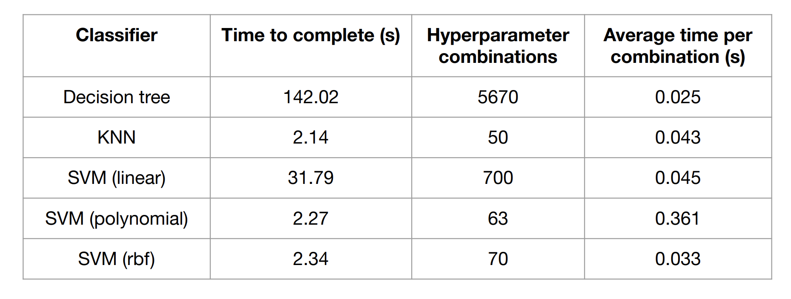
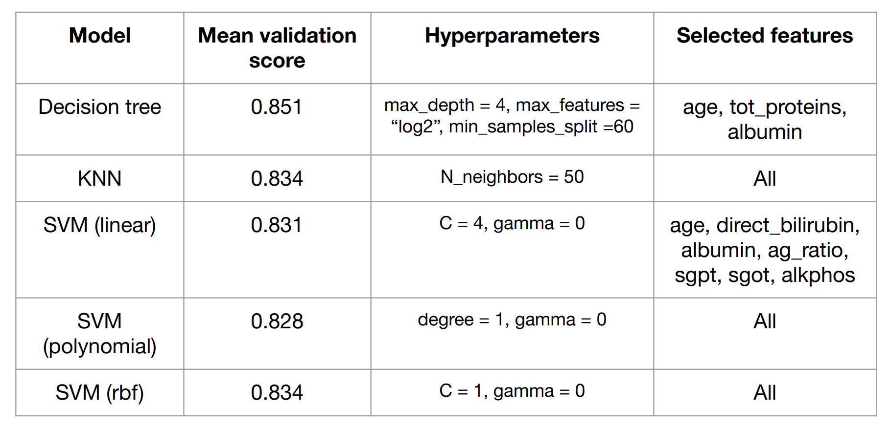
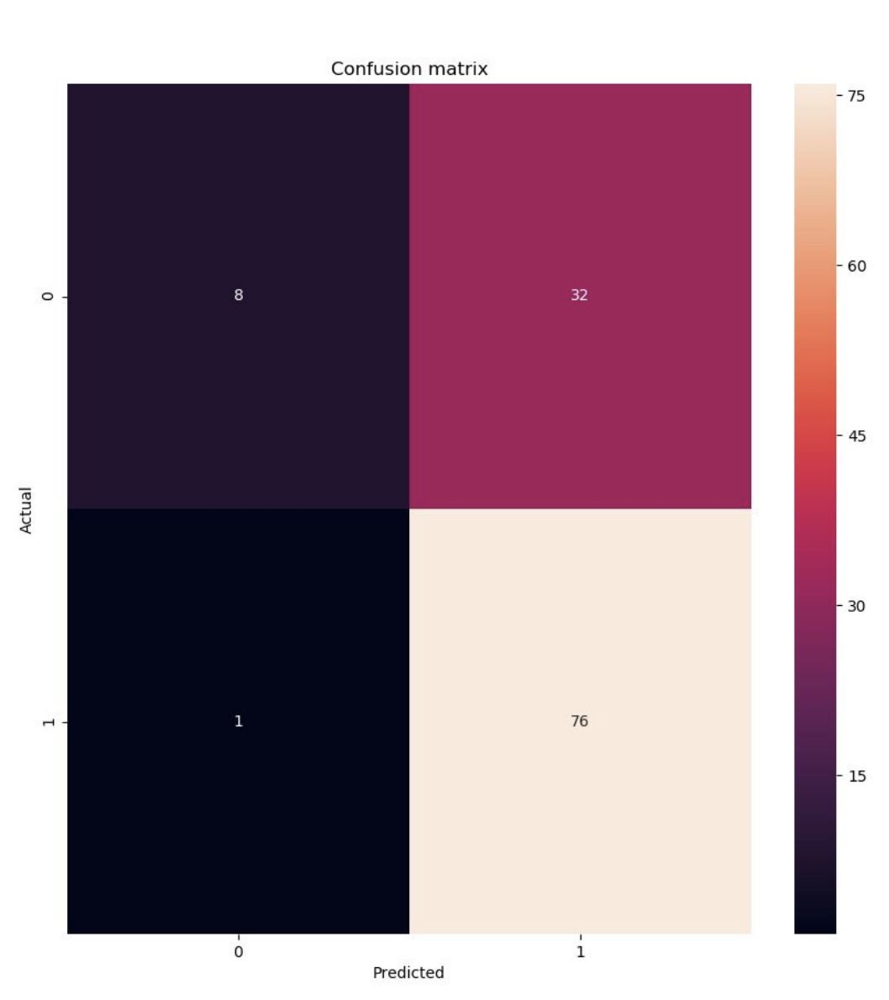

# Liver disease prediction
V1.0: The goal of this project is to accurately predict whether or not a patient has liver disease based on biological features.

**Scientific question:** 
Can we accurately predict the development of liver disease in India from certain biological markers? If so, can we determine which markers are most useful for the prediction?

We also want to deploy our classifier as simple REST API to simulate an on-demand prediction service for doctors

## Dataset

The dataset we used consists of records for 583 patients from a region northeast of Andhra Pradesh, India. 416 of the patients have liver disease and 167 of the patients are healthy. There are 10 biological features per each patient in addition to a class label of 0 or 1 (healthy or liver disease).

The data is contained in the Indian Liver Patient Dataset (ILPD).csv file of this repository

## Getting started

These instructions will get you a copy of the project up and running on your local machine.

### Prerequisites

The following packages were used during the development of this code. Other versions may be supported, but cannot be guaranteed.

- python (version 3.7.0)
- pycodestyle (version 2.5.0)
- numpy (version 1.17.2)
- seaborn (version 0.9.0)
- pandas (version 0.25.1)
- flask (version 1.1.1)
- requests (version 2.22.0)
- matplotlib (version 3.1.0)
- jsonpickle (version 1.2)

### Installation

The following steps will help you set up the proper environment on your machine. All example commands are entered directly into terminal.

**Installing conda:**

```
cd $HOME
wget https://repo.anaconda.com/miniconda/Miniconda3-latest-Linux-x86_64.sh
bash Miniconda3-latest-Linux-x86_64.sh -b
. $HOME/miniconda3/etc/profile.d/conda.sh
conda update --yes conda
conda config --add channels bioconda
echo ". $HOME/miniconda3/etc/profile.d/conda.sh" >> $HOME/.bashrc
```

**Creating conda environment:**

```
conda create -y -n <your_environment>
conda install -y python=3.7
```

**Activating conda environment:**

```
conda activate <your_environment>
```

**Installing pycodestyle:**

pycodestyle is used to ensure that all .py files adhere to the PEP8 style guidelines.

```
conda install -y pycodestyle
```

**Installing pandas:**

pandas is used to import data and organize/clean it prior to the machine learning classification task

```
conda install -y pandas
```

**Installing scikit-learn:**

scikit-learn is a machine learning library and provides implementations of classifiers, pipelines, confusion matrices, grid search, recursive feature elimination, etc. 

```
conda install -y -c anaconda scikit-learn
```

**Installing flask**

Flask is a simple Python web framework and provides the backbone of the REST API prediction endpoint

```
conda install -y -c anaconda flask
```

**Installing numpy:**

numpy is required for transformation of data prior to the machine learning classification task

```
conda install -y numpy
```

**Installing requests:**

requests is required to make HTTP requests to the REST API prediction endpoint

```
conda install -y requests
```

**Installing matplotlib:**

matplotlib is required to build the visualizations of our exploratory data analysis and the final confusion matrix

```
conda install -y matplotlib
```

**Installing seaborn:**

seaborn is required to build the visualizations of our exploratory data analysis and the final confusion matrix

```
conda install -y seaborn
```

**Installing jsonpickle:**

jsonpickle is required to serialize Python objects into JSON format during HTTP requests and responses

```
conda install -y jsonpickle
```

### Examples
select_model.py is the primary component of this project. It takes a JSON configuration file (see config_dummy.json for sample) and uses its contents to load a dataset, split the dataset into train-test samples, build a ML pipe, and run a grid search using k-fold cross validation to search for optimal hyperparameters.

The output of this script includes print statements of the total grid search runtime, the # of hyperparameters explored, the best hyperparameter combination, the validation score associated with this combination, the best model, and the features selected (if applicable). Additionally, the full grid search results are saved to a .csv file, the best model is saved to a .pkl file, and the model is evaluated using the previous hidden test set, resulting in the generation of a confusion matrix .png file. 

```
python select_model.py <your_config_file.json>
```

The REST API server can be initialized using the following command. After it is running, it will be able to take incoming requests from clients, use the pretrained best model to make a prediction, and return this prediction in the form of a response JSON.

```
python rest_server.py or nohup python rest_server.py & (to run in background)
```

Once the REST server is running, HTTP requests can be submitted to it using the rest_client.py script. The user must specify host IP address, patient ID, and 11 patient features (space separated). The request will be processed by the REST server and a response will be returned in the form of a JSON.

```
python rest_client.py <ip_address> <patient_id> <feature 1> <feature 2> ... <feature 11>
```

The rest_client.py and rest_server.py are tested using functional_test.sh. This bash script starts up the rest_server and submits two sample HTTP requests. It also runs select_model.py for testing purposes since this script was too complicated to test otherwise.

```
bash functional_test.sh
```

unit_tests.py runs several unit tests on the functions in the liver_function.py module to ensure correctness and proper handling of errors.

```
python unit_tests.py
```

liver_explore.py enables hyperparameter tuning visualization using distinct kernels. The main function accepts argparsed command line arguments to specify the type of classifier (K-nearest neighbors, support vector machines, and decision trees) and the locations of the resulting visualizations.
```
python liver_explore.py --output_file example_output_location --classifier_type DT
```
Some of the visualizations are given below:


## Benchmarking results
During the grid search portion of the select_model.py script, we measured the time necessary for all k-fold cross validation to complete. Cross validation was parallelized over 12 CPUs. The results are shown in the table below.



## Cross validation results
The top performing models, their associated hyperparameters, and their features sets are shown in the table below. The best performing model (the decision tree) was then used to evaluate the previously hidden test set.



## Test set performance:
The final test set consisted of 77 liver disease patients and 40 healthy patients. Our model achieved an F1 score of 0.825. The confusion matrix shown below details the predictions made by the model.



## Authors

**Michael W. Chifala and Andrew Levitt** - University of Colorado, Boulder, CSCI 7000: Software Engineering for Scientists


## Acknowledgments

* Mokdad, A.A., Lopez, A.D., Shahraz, S. et al. Liver cirrhosis mortality in 187 countries between 1980 and 2010: a systematic analysis. BMC Med 12, 145 (2014) doi:10.1186/s12916-014-0145-y
* Lichman, M. (2013). UCI Machine Learning Repository
[http://archive.ics.uci.edu/ml]. Irvine, CA: University of California, School of Information and Computer Science.
* Scikit-learn documentation. https://scikit-learn.org/stable/ (2019).
* Ryan Layer's CSCI 7000 "Development Environment" document
* Ryan Layer's CSCI 7000 "Continuous Integration with Travis CI" document
* Ryan Layer's CSCI 7000 "Test-Driven Development" document
* PEP8 Style Guidelines: https://www.python.org/dev/peps/pep-0008/
* Github: PurpleBooth/README-Template.md